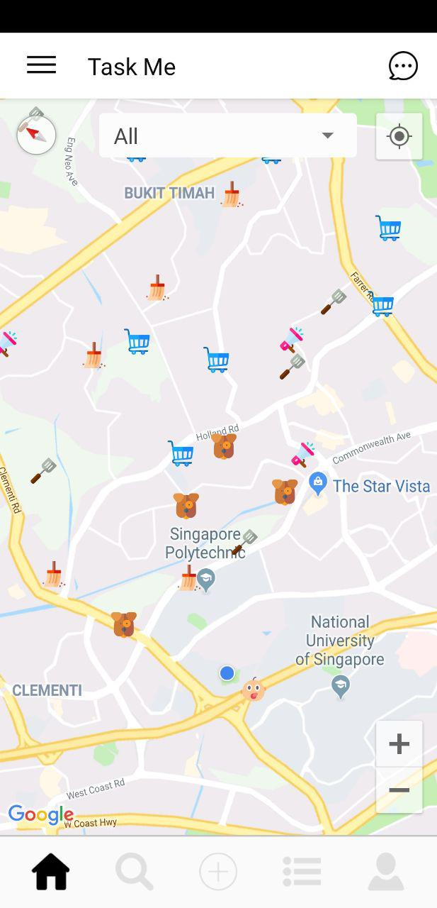
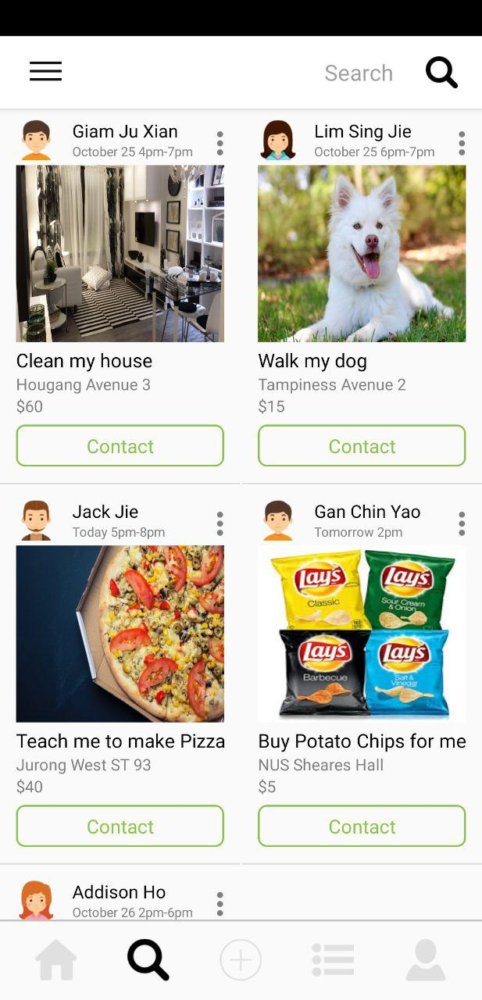
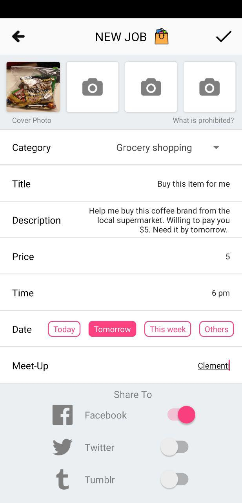
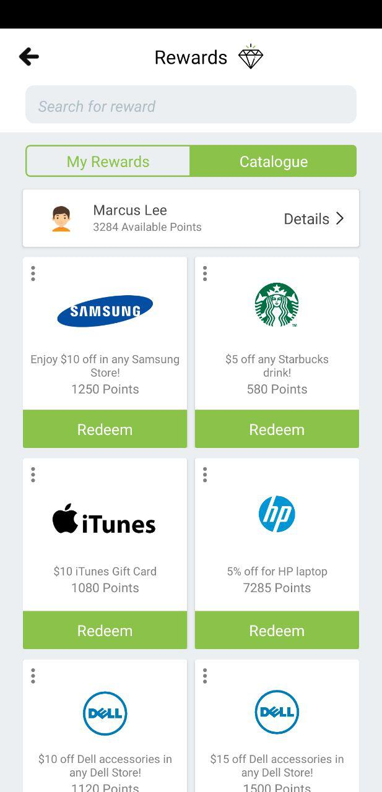

# TaskMe
## Codeathon 2018: Code for Asia

This is a prototype of a platform that allows anyone to search for quick jobs around the corner.

&nbsp;
&nbsp;

&nbsp;
&nbsp;

### About
* This Android app was created for the problem statement of "How might we make possible more flexible working opportunities?"
* This app was created in 24 hours for the hackathon called `codeathon 2018` organized by Code for Asia

### How this app works
* User can submit a new job request listing, or take up existing job listings from other users
* This app is targetted at mundane day-to-day tasks, such as cleaning of rooms, walking the dog, buying groceries, baby sitting, cooking etc.
* The map interface allows users to browse through listings by location
* Upon completion of a job listing, users can earn points, which can be exchanged for rewards such as gift vouchers or promotional discounts from participating merchants
* This is a self-sustaining platform whereby a user can be both job-seeker and job-lister

### How to use
* Change the `google_maps_key` in `google_maps_api.xml` file to access Google Map Services. To get a `google_maps_key`, follow the official documentation provided by Google. If you do not change the `google_maps_key` to a valid one, the Map interface will not work properly. However, other aspects of the app will still work.

### Note
* This app was created in 24 hours as an entry for a hackathon competition.
* As such, this app is not complete and not fully functional. If a button could not be pressed, there is a high chance that the button is not yet implemented in this prototype. Bugs may be present.
* Code was written quickly to meet the 24 hours deadline. Therefore, coding standard may not be strictly adhered. Hardcode was used to speed up the process.
* This app was a one time project and will NOT be updated anymore.
